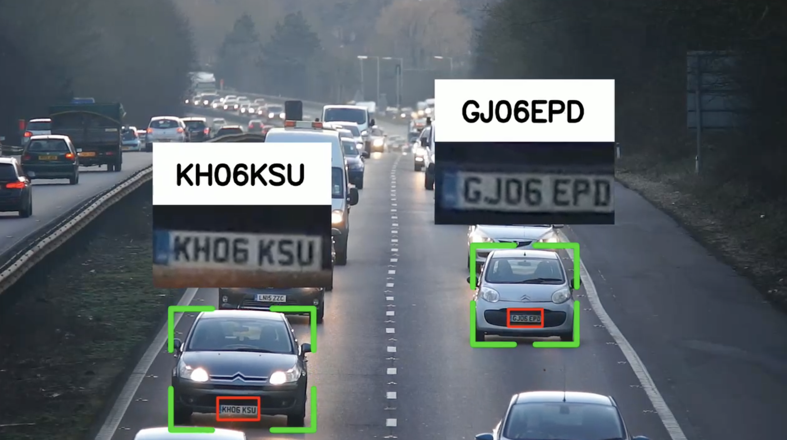

# Traffic Analysis and Vehicle Counting System

A robust, intelligent traffic monitoring system built to detect, track, and analyze vehicle movement in diverse conditions using advanced computer vision and transformer-based AI models.


### Team Members:
**Mayank Jangid**, **Kushal Khemka**, **Abhinav Rajput**

---
## Project Overview

This system is designed to go beyond basic vehicle detection — offering:

- **Real-time vehicle counting**
- **Multi-object tracking**
- **Speed estimation**
- **Automatic Number Plate Recognition (ANPR)**
- **Congestion detection**
- **Weather-resilient detection**
- **Vision-Language scene understanding**

---

## Key Features

### Object Detection & Model Evaluation
Evaluated 8 models across precision, recall, and AP metrics:

| Model             | AP50  | AP50_95 | Precision | Recall |
|-------------------|-------|---------|-----------|--------|
| **RF-DETR-Large** | 0.985 | 0.790   | 0.967     | 0.957  |
| YOLOv8            | 0.977 | 0.779   | 0.955     | 0.932  |
| YOLOv12           | 0.974 | 0.774   | 0.922     | 0.945  |
| YOLOv11           | 0.974 | 0.774   | 0.930     | 0.947  |
| RT-DETRv3-R50     | 0.968 | 0.765   | 0.942     | 0.939  |
| RT-DETRv2-R101    | 0.961 | 0.759   | 0.937     | 0.935  |
| RT-DETRv2-R50     | 0.957 | 0.752   | 0.931     | 0.930  |
| RT-DETR-X         | 0.935 | 0.742   | 0.907     | 0.920  |

**Recommendations**:
-  RF-DETR-Large: Best for precision-critical deployments  
-  YOLOv8: Best accuracy-efficiency tradeoff  
-  YOLOv12: For using latest YOLO advancements  
-  RT-DETRv3-R50: End-to-end transformer solution

---

## Weather-Robust Augmentation

To maintain high performance under fog, rain, and snow:

- **Analytical Augmentation**: Depth-based weather simulation
- **Neural Style Transfer**: Stylistic weather transformations

> Result: Improved generalization under challenging environmental conditions

---

## Tracking & Analytics

### Multi-Object Tracking with ByteTrack
- High accuracy tracking via low- and high-confidence box associations
- Handles occlusions and low-light scenarios effectively

### Dwell Time & Congestion Detection
- Custom ROI tracking for zone-specific monitoring
- EMA-based congestion detection using statistical thresholding
- Supports dynamic adjustment based on location-specific historical data

---

## Automatic Number Plate Recognition (ANPR)
- YOLO-based plate detection
- OCR for character extraction
- Works under varying lighting, angles, and plate formats




---

## Speed Estimation

- Frame-to-frame pixel displacement analysis
- Supports relative speed calculation with multi-object tracking
- Highlights need for accurate camera calibration for real-world units

---

## Vision-Language Integration

### Using **Qwen-2.5VL-7B**:
- Scene understanding and description
- Object relationship detection
- Natural language summaries of traffic flow and congestion events
- Bounding box and point-based object localization

---

## System Architecture

```
[Video Input] → [Object Detection] → [ByteTrack Tracker]
             → [ROI Analyzer] → [Dwell Time, Congestion]
             → [Speed Estimator] 
             → [ANPR Module]
             → [Qwen2.5-VL Scene Description]
```

---

## References

- RF-DETR: https://github.com/roboflow/rf-detr  
- Qwen2.5-VL: https://github.com/QwenLM/Qwen-VL  
- ByteTrack: https://github.com/ifzhang/ByteTrack  
- Weather Augmentation Paper: https://openaccess.thecvf.com/content/WACV2024/papers/Gupta_Robust_Object_Detection_in_Challenging_Weather_Conditions_WACV_2024_paper.pdf  
- PaliGemma 2: https://developers.googleblog.com/en/introducing-paligemma-2-mix/

---

## Future Work

- Real-world speed enforcement with geometric calibration
- Deployment on embedded edge devices
- Integration with traffic signal optimization systems

---

# Clone the repository

```
git clone https://github.com/mayank-jangid-moon/Traffic_Flow_Analysis.git
cd Traffic_Flow_Analysis
```


